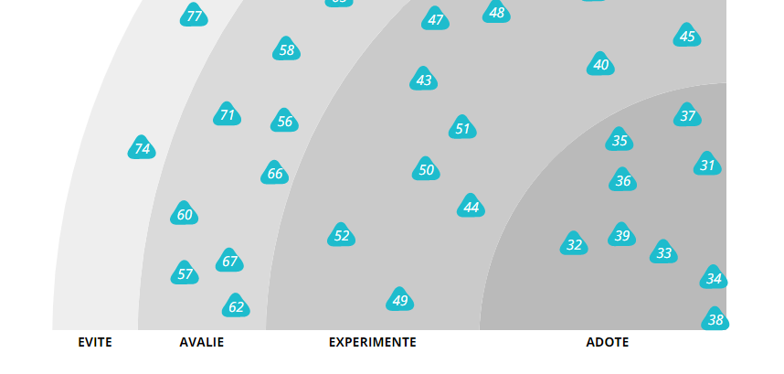

# Benner Technology Radar

Inspired on ThoughtWorks radar, we as one of 10 biggest brazilian software company realized that make a lot of sense to map out our technology stack for whole company and partners.

We are all learning here, feel free to criticize or suggest any change for next edition.

Explore all volumes [here](https://dev.benner.com.br/radar/).

## Guia de contribuição

Veja [aqui](CONTRIBUTING.md) como contribuir.

## Estrutura

### Adote

Neste anel estão os itens já consolidados, que sabemos que são efetivos ao que se propõe quando utilizados em nossa arquitetura, que são maduros e que você pode e deve utilizar em seus projetos, sem nenhum receio.

### Experimente

São blips considerados prontos para o uso, mas que ainda não foram colocados tão à prova em nossa arquitetura quando os itens do anel "Adote", portanto a efetividade ainda não está atestada ou comprovada.

### Avalie

São itens para serem analisados de perto, mas não necessariamente para serem experimentados ainda - a menos que você ache que eles são significativamente adequados para você. Geralmente representam coisas que consideramos interessantes e que vale à pena prestar atenção.

### Evite

São para itens dos quais não tivemos boa experiência e que você deve evitar o uso.
